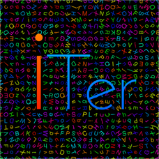
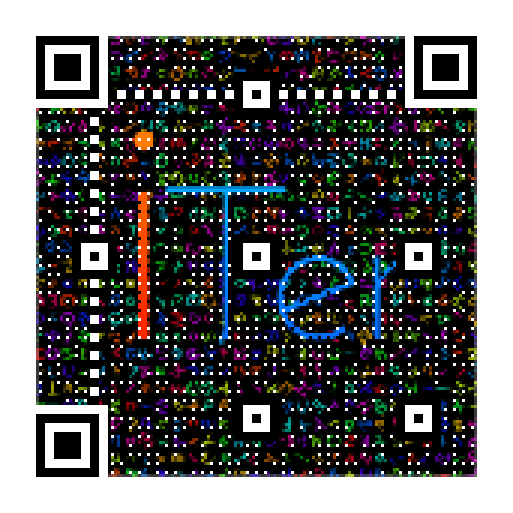
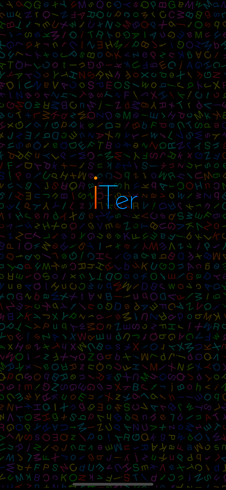
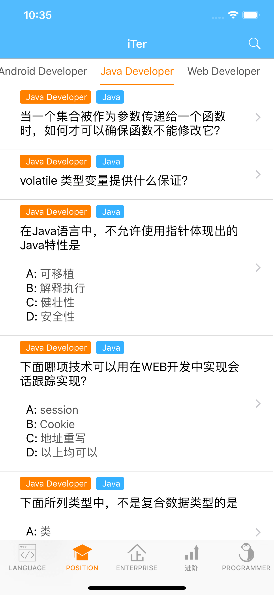
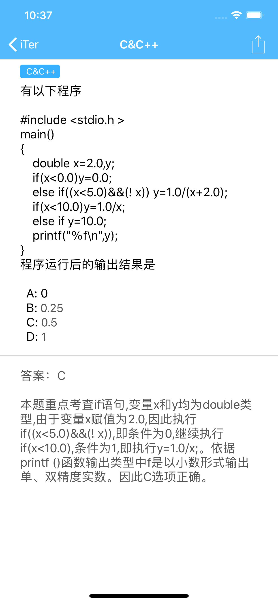
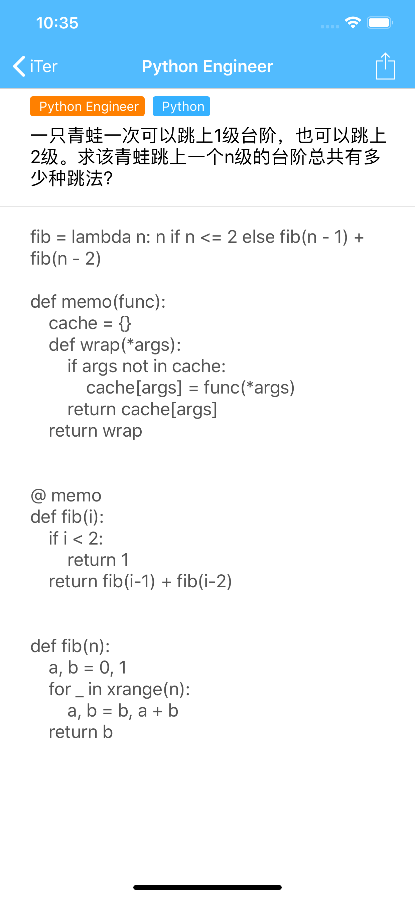
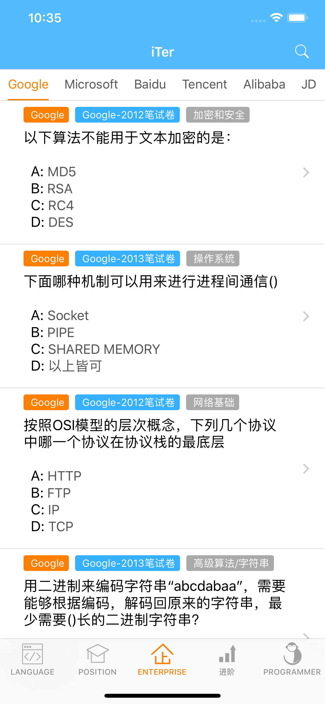
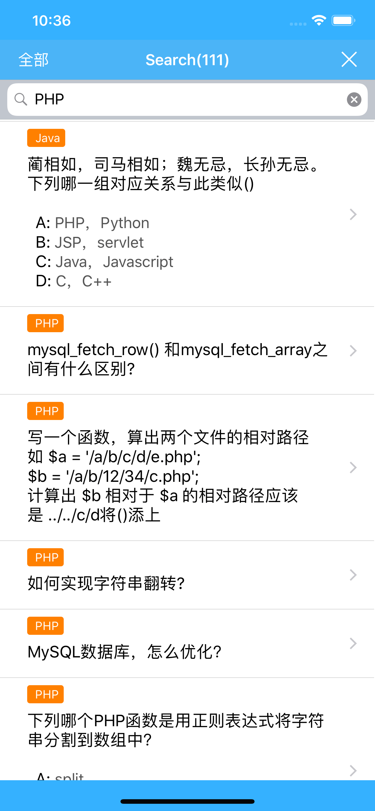
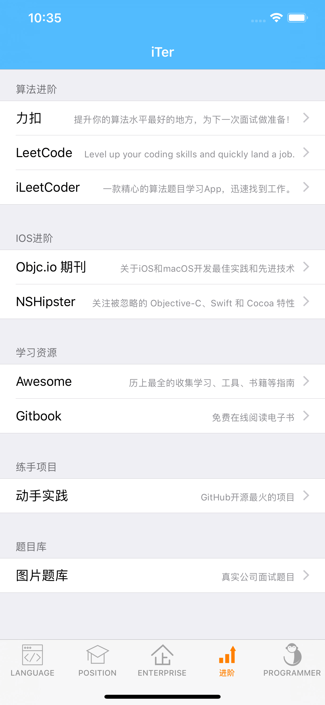
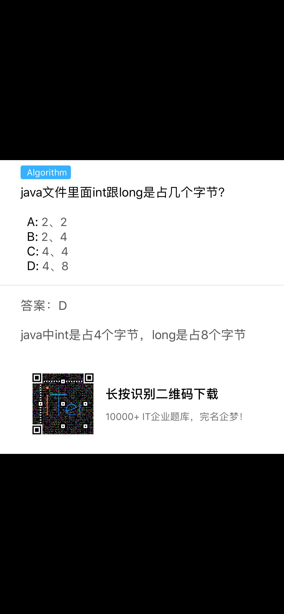

# iTer
iTer is technical problems library for iOS App, in order to it learners better understand knowledge, understand their mastery of the content.

### 项目介绍

iTer - IT学习、求职面试必备，IT面试基础必备试题指南。

iTer - IT learning, job interview essential, IT interview basic exam questions guide.

### 项目学习
本应用主要是学习到Swift的使用和页面切换动画、流水布局使用。

### 下载地址

> 因为苹果开发者账号需要年费，所以 App Store 下载收费人民币1元，如果介意，可以下载本项目源代码，自动编译安装。

- [iOS App Store](https://itunes.apple.com/cn/app/iter-it学习-求职面试必备/id1224934068?l=zh&ls=1&mt=8)

### 应用截图

|  |  |
| ----- | ----- |
|  |  |
|  |  |
|  |  |
|  |  |

